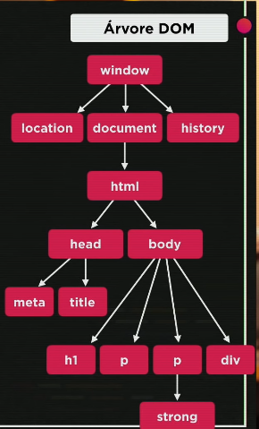

DOM (Document Object Model) é modelo de objetos para documentos.

Selecionar elementos para navegar dentro da árvore DOM.

Métodos de acesso:

- por marca
  - getElementByTagName()
- por ID
  - getElementById()
- por nome
  - getElementByName()
- por Classe
  - getElementByClassName()
- por Seletor
  - querySelector()
